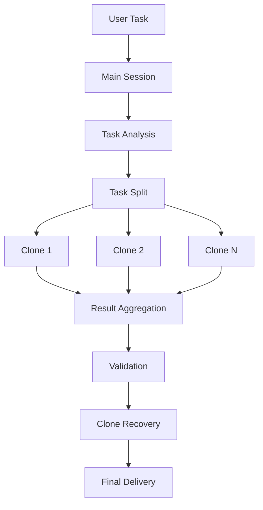

# Shadow Clone

> **Turn one operator into a parallel execution squad.**

`shadow-clone` is a practical OpenClaw skill built for **parallel subagent execution**. It uses `sessions_spawn` to split work into independent subtasks, dispatch them to subagents, and let the main session focus on coordination, supervision, validation, and final delivery.

## Core Positioning

`shadow-clone` is the **parallel execution layer**, not the governance layer.

It is best understood as:
- a tactical formation system
- a subagent dispatch layer
- a clone recovery system
- a real-time reporting workflow

It works alongside:
- `cyber-emperor` for governance and orchestration
- `claude-code-hook` for heavy coding execution

## Good Fit

Use it for:
- medium-sized tasks with clean split boundaries
- work that benefits from parallel execution
- document organization, data processing, and structured coding work
- tasks where the main session should act as commander rather than sole worker

Avoid it for:
- tiny tasks
- highly coupled same-file edits
- project-scale work that needs governance and review layers

## Architecture

## Public Publishing Rule

This public repository must not contain any secrets, tokens, passwords, private keys, cookies, sessions, or other credentials.

Share methods, not keys.
