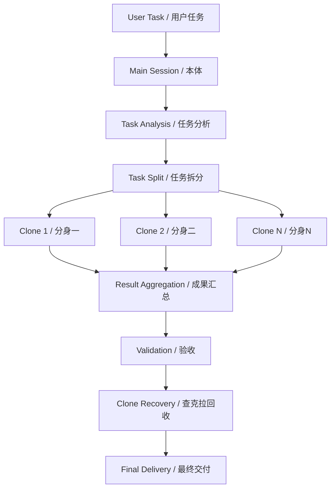
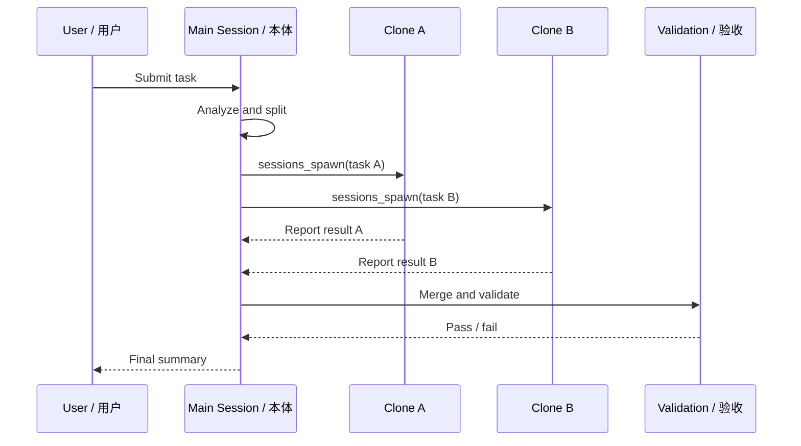

# Shadow Clone / 影分身之术

> **Turn one worker into a tactical squad.**  
> **不是一个人硬扛，而是把任务拆给一支真正能并行作战的分身部队。**

`shadow-clone` is a practical OpenClaw skill focused on **parallel task execution**. It uses `sessions_spawn` to dispatch independent subagents, letting the main session act as commander, coordinator, and final integrator.

`shadow-clone` 是一个面向 OpenClaw 的实战型 skill，核心能力是 **并行派发分身执行任务**。它通过 `sessions_spawn` 把独立子任务交给多个分身推进，而本体负责分析、拆分、监工、汇总和验收。

---

## Documents / 文档

- English: [README.en.md](./README.en.md)
- 中文： [README.zh-CN.md](./README.zh-CN.md)
- Skill definition / 技能定义： [skills/shadow-clone/SKILL.md](./skills/shadow-clone/SKILL.md)

---

## What makes it powerful / 它为什么强？

Most agents are single-threaded in practice: they think, act, wait, and report in one line.

而 `shadow-clone` 做的，是把本来要串行推进的工作，拆成多个边界清晰、目标明确、可独立执行的子任务，让多个分身同时开工。

It is powerful because it gives you:

- real parallel execution / 真实并行执行
- clearer role separation / 更清晰的角色边界
- faster turnaround for multi-part work / 更快的多段任务推进
- better use of the main session as orchestrator / 让本体专注统筹而不是陷入细碎劳动

---

## Core Positioning / 核心定位

`shadow-clone` is the **parallel execution layer**.

它的职责非常纯粹：
- 拆分任务
- 派出分身
- 并行推进
- 实时汇报
- 回收分身

It is not primarily a governance model like `cyber-emperor`.

它不是像 `cyber-emperor` 那样的治理框架，而是更偏向“兵部作战系统”——强调执行阵型、分身调度和查克拉回收。

### Relationship with other capabilities / 与其他能力的关系

- **`shadow-clone`** — parallel dispatch and subagent execution
- **`cyber-emperor`** — governance, structure, and delivery control
- **`claude-code-hook`** — complex coding execution for heavy implementation tasks

也就是说：

- **影分身**：擅长并行干活
- **赛博皇帝**：擅长定朝纲和统御全局
- **Claude Code Hook**：擅长接管复杂编码

---

## Shadow Clone Architecture / 影分身架构图

---

## What it is good at / 它擅长处理什么任务？

### Good fit / 适合场景

- medium-size tasks with clear split boundaries / 可明确拆分的中等任务
- multi-part work that benefits from parallel execution / 适合并行推进的多段任务
- document organization, data processing, structured coding work / 文档整理、数据处理、结构化编码任务
- work where the main session should coordinate rather than do everything itself / 本体更适合当指挥官的任务

### Not a good fit / 不适合场景

- tiny direct tasks / 很小的直接任务
- highly coupled edits to the same file / 高耦合同文件改动
- tasks that need a full governance framework / 需要完整治理框架的项目级任务
- work better handled directly by `cyber-emperor` + `claude-code-hook` / 更适合赛博皇帝统筹的复杂项目任务

---

## Execution Principles / 执行原则

1. split by boundary, not by wishful thinking / 按边界拆，不按想象拆
2. parallel only when conflict risk is low / 只有低冲突任务才并行
3. report immediately after dispatch / 放出分身立刻汇报
4. recover clones immediately after completion / 分身完成立刻回收
5. use `claude-code-hook` for heavy coding tasks / 复杂编码交给 Hook

---

## Public Publishing Rule / 公开发布铁律

This public repository must not contain any secrets, tokens, passwords, private keys, cookies, sessions, or other credentials.

本公开仓库不得包含任何密钥、令牌、密码、私钥、Cookie、Session 或其他凭据。

Share methods, not keys.  
公开 skill，发方法，不发钥匙。
