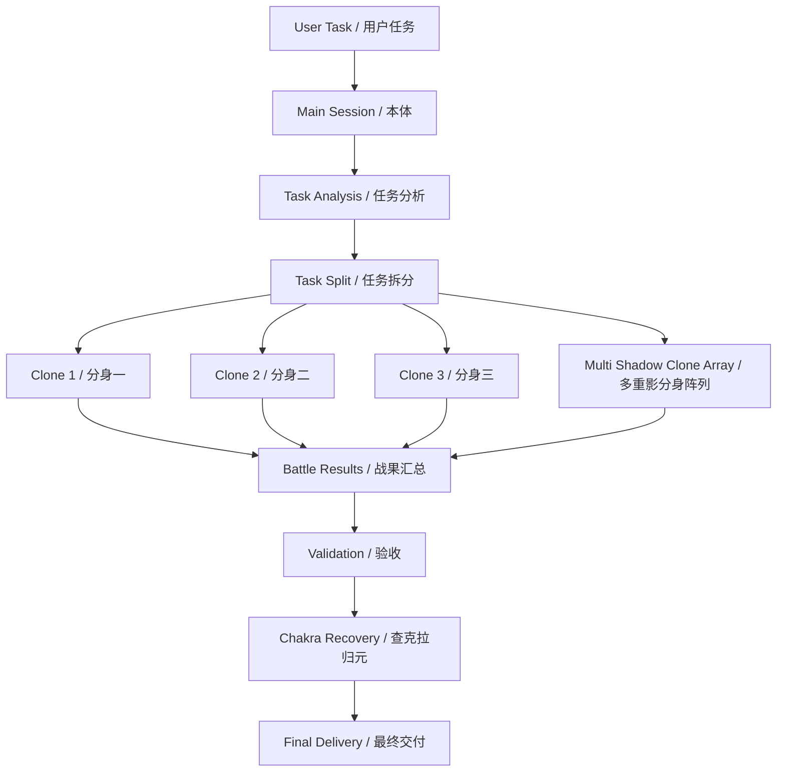

# Naruto · Multi Shadow Clone / 火影·鸣人·多重影分身

> **Turn one operator into a full combat squad.**  
> **不是一个人硬扛，而是像鸣人一样，一次结印，直接拉出一整队能并行作战的分身。**

`shadow-clone` is a practical OpenClaw skill for **parallel subagent execution**. Inspired by Naruto's iconic **Multi Shadow Clone Jutsu**, it transforms one task stream into multiple coordinated execution units through `sessions_spawn`, while keeping the main session in the role of commander, strategist, and final integrator.

`shadow-clone` 是一个面向 OpenClaw 的实战型并行执行 skill。它借用鸣人的 **多重影分身之术** 作为灵感，把单线程任务流扩展成多个协同作战单位，通过 `sessions_spawn` 同时推进，而本体始终保持总指挥、总汇总和最终交付者的位置。

---

## Documents / 文档

- English: [README.en.md](./README.en.md)
- 中文： [README.zh-CN.md](./README.zh-CN.md)
- Skill definition / 技能定义： [skills/shadow-clone/SKILL.md](./skills/shadow-clone/SKILL.md)

---

## Why it hits hard / 为什么它够猛？

Most agents execute like a lone fighter. `shadow-clone` executes like a squad.

普通 agent 更像单兵作战，`shadow-clone` 更像一支分身战术编队。

It is powerful because it gives you:

- real parallel execution / 真实并行执行
- better task pressure distribution / 更好的任务压力分摊
- faster turnaround across multiple subtasks / 更快的多段任务推进速度
- a stronger role for the main session as commander / 让本体真正回到指挥官位置
- clone recovery discipline to avoid token leakage / 有查克拉归元机制，避免资源泄漏

---

## Core Positioning / 核心定位

`shadow-clone` is the **parallel execution layer**.

It is not mainly about governance. It is about:

- task split / 拆任务
- subagent dispatch / 放分身
- parallel attack / 并行推进
- real-time reporting / 实时回报
- clone recovery / 查克拉回收

That makes it the tactical battle layer, not the imperial governance layer.

它更像战术作战层，而不是治理统御层。

### Relationship with other capabilities / 与其他能力的关系

- **`shadow-clone`** — parallel dispatch and subagent execution
- **`cyber-emperor`** — governance, structure, delivery control
- **`claude-code-hook`** — heavy coding execution for difficult implementation tasks

---

## Multi Shadow Clone Architecture / 多重影分身架构图

---

## Good Fit / 适合场景

- medium-size tasks with clean split boundaries / 可明确拆分的中等任务
- multi-part work that benefits from parallel execution / 适合并行推进的多段任务
- document organization, data processing, structured coding work / 文档整理、数据处理、结构化编码
- tasks where the main session should command rather than do everything alone / 本体更适合当指挥官的任务

## Not a Good Fit / 不适合场景

- tiny direct tasks / 很小的直接任务
- highly coupled same-file edits / 高耦合同文件改动
- project-scale work that requires governance and review layers / 需要完整治理与审查的项目级任务

---

## Public Publishing Rule / 公开发布铁律

This public repository must not contain any secrets, tokens, passwords, private keys, cookies, sessions, or other credentials.

本公开仓库不得包含任何密钥、令牌、密码、私钥、Cookie、Session 或其他凭据。

Share methods, not keys.  
公开 skill，发方法，不发钥匙。
