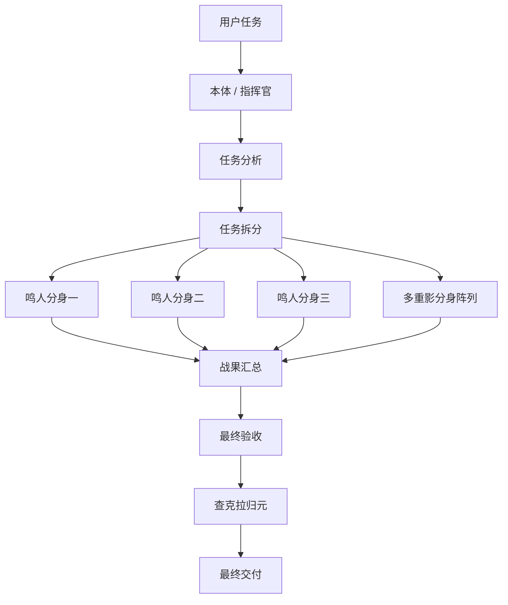
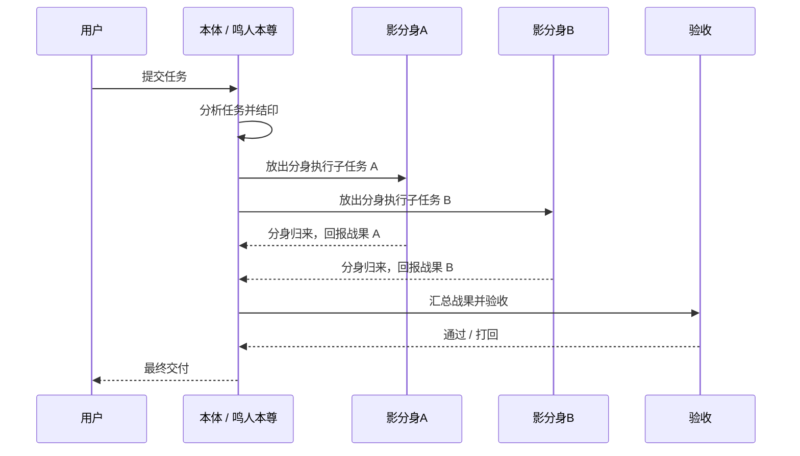

# 火影·鸣人·多重影分身（Shadow Clone）

> **不是一个人硬扛，而是像鸣人一样——一口气放出多重影分身，把复杂任务直接围起来打。**

`shadow-clone` 是一个面向 OpenClaw 的并行执行 skill。它借用《火影忍者》里**鸣人的多重影分身之术**作为灵感，把原本需要串行推进的任务，拆成多个边界清晰、职责明确、可以同时推进的子任务，并通过 `sessions_spawn` 放出多个分身并行执行。

如果说普通工作流是“一个人慢慢做”，那么 `shadow-clone` 做的是：

- 一次分析，分出多个战斗单位
- 同时推进多个子任务
- 实时回传结果
- 查克拉归元，回收分身经验
- 最终由本体合并成果、统一验收、对外交付

一句话：

**这不是普通并行，这是带着火影味道的 AI 多重影分身作战系统。** 🥷🔥

---

## 核心定位

`shadow-clone` 是 **并行执行层**，不是治理层。

它最擅长的不是定制度，而是：
- 快速拆任务
- 快速放分身
- 快速并行推进
- 快速汇报战果
- 快速回收查克拉

所以它更像：
- **鸣人的多重影分身战术系统**
- **并行作战阵型**
- **分身调度与回收系统**
- **实时战况播报系统**

而不是：
- 项目治理框架
- 审批制度
- 长链路风控系统

如果要一句话概括：

> **赛博皇帝负责建朝廷，影分身负责打正面。**

---

## 为什么它很能打

很多任务并不是难在“不会做”，而是难在：
- 太碎
- 太多
- 太杂
- 太慢
- 本体一个人来回切换上下文，效率被拖死

`shadow-clone` 的价值就在这里爆发：

### 1. 一次结印，多个分身同时开工
本体分析一次，把任务拆成多个分身子任务，直接并行推进。

### 2. 本体不再陷入细活泥潭
本体负责：
- 分析
- 拆分
- 指挥
- 汇报
- 验收

分身负责：
- 真正执行
- 按边界推进
- 及时回报

### 3. 查克拉管理更像真实战斗系统
不是分身放出去就不管，而是：
- 放出时立刻汇报
- 完成后立刻归来
- 失败时强制回收
- 所有分身必须归元，避免 Token 泄漏

### 4. 与 Claude Code Hook 配合后，火力更猛
遇到复杂编码时，普通分身不硬扛，而是联动 `claude-code-hook`。
这相当于：

- 分身前去交战
- 遇到高强度攻坚目标
- 直接请出“工部重器”接管
- 完成后再把成果带回本体

这就让它不仅能快，还能在复杂任务上打得稳。

---

## 它和鸣人“多重影分身”为什么像

因为这套 skill 的精神内核，和鸣人的多重影分身非常接近：

### 鸣人影分身的核心感觉
- 数量优势
- 并行压制
- 多点同时推进
- 本体保持主视角与决断权
- 分身归来后经验汇总到本体

### `shadow-clone` 的对应能力
- 多个 subagent 同时执行
- 多条子任务链并行推进
- 本体始终是总指挥
- 分身完成后结果汇总给本体
- 本体统一做最终判断和交付

所以它不是随便借个名字，而是真的抓住了“多重影分身”的方法论：

**本体不再单线程苦战，而是把战斗力分布到多个可控战斗单位上。**

---

## 它适合什么任务

### 适合场景

- 中等复杂任务
- 多段任务并行推进
- 多个子任务之间边界清晰的工作
- 文档整理、资料归纳、结构化编码
- 同时要做多块但又不想本体一个人来回切换上下文的任务

例如：
- 一边整理 README，一边补示例文档
- 一边分析模块 A，一边实现模块 B
- 一边测试，一边整理交付说明
- 一边搜集资料，一边归纳对比结论

### 不适合场景

- 单文件小修
- 单步直接操作
- 高耦合同文件并发改动
- 需要严格审批链和治理结构的项目级任务

如果任务需要更完整的统御、审查、交付制度，那应该交给：
- `cyber-emperor` 做治理
- `shadow-clone` 做兵部执行

---

## 架构图

---

## 它和其他能力的关系

- `shadow-clone`：**并行执行层**
- `cyber-emperor`：**治理统御层**
- `claude-code-hook`：**复杂编码执行层**

也就是说：

- **影分身** 负责多点作战
- **赛博皇帝** 负责朝纲、秩序与收口
- **Claude Code Hook** 负责高强度技术攻坚

这三者组合起来，就不是“一个助手在做事”，而是一套真正有层次、有节奏、有火力分配的 AI 作战体系。

---

## 仓库内容

- `README.md`：中英双语入口
- `README.zh-CN.md`：中文说明
- `README.en.md`：English 说明
- `skills/shadow-clone/SKILL.md`：技能主文档
- `skills/shadow-clone/README.md`：skill 简介

---

## 公开发布规则

- 不携带任何密钥、Token、Cookie、私钥、密码、Session
- 公开 skill，发方法，不发钥匙
- 默认提供中文 + English 双版本文档
- 对外说明允许更有气势，但不能虚构不存在的能力

---

## 最后一口气势

`shadow-clone` 最厉害的地方，不是名字像火影，而是它真的抓住了“多重影分身”的精髓：

**本体只需一次结印，战力就能在多个方向同时展开；而当所有分身归来，本体得到的不是噪音，而是一整场战斗的成果。**

这就是为什么它不是普通并行，而是：

> **火影·鸣人·多重影分身式的 AI 并行作战系统。** 🥷⚡🔥
