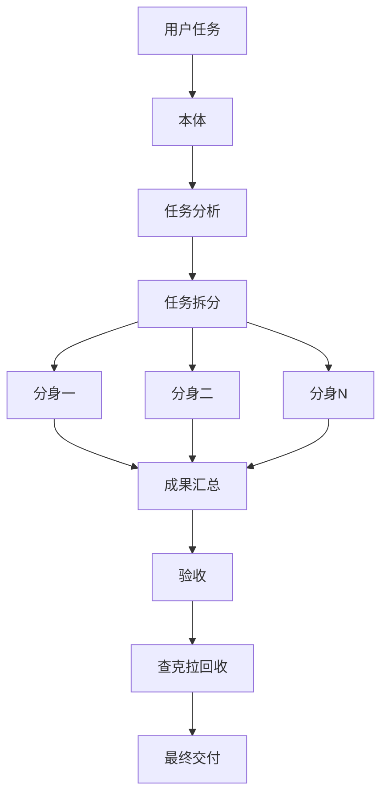

# 影分身之术（Shadow Clone）

> **把一个执行者，扩成一支能并行作战的分身部队。**

`shadow-clone` 是一个面向 OpenClaw 的并行执行 skill。它的核心不是“热闹”，而是把原本必须串行推进的任务，拆成多个彼此独立、边界清晰、可以同时推进的子任务，并通过 `sessions_spawn` 放出多个分身并行执行。

它最擅长解决的问题是：
- 一个任务里有多个可独立推进的部分
- 本体更适合负责分析、监工和汇总，而不是亲自下场干所有细活
- 需要更快的任务周转速度
- 需要把复杂任务拆成多个阶段、多个角色同步推进

## 核心定位

`shadow-clone` 是 **并行执行层**，不是治理层。

它更像：
- 作战阵型
- 分身派工系统
- 查克拉管理系统
- 实时汇报系统

而不是：
- 项目治理框架
- 审批制度
- 完整交付制度

所以它与其他能力的关系很明确：
- `shadow-clone` 负责 **并行派工**
- `cyber-emperor` 负责 **统御、规划、风险控制、交付收口**
- `claude-code-hook` 负责 **复杂编码零轮询执行**

## 它为什么强

因为它让本体不再被琐碎执行拖住，而是变成真正的指挥官：
- 本体负责分析和拆分
- 分身负责执行
- 分身归来后本体负责合并与验收
- 查克拉用完就回收，不留残影，不浪费 Token

## 适用场景

适合：
- 中等复杂任务
- 多段任务并行推进
- 文档整理、资料归纳、结构化编码
- 多子任务之间边界清晰的工作

不适合：
- 单文件小修
- 高耦合同文件并发改动
- 需要完整治理框架的项目级任务

## 架构图

## 仓库内容

- `README.md`：中英双语入口
- `README.zh-CN.md`：中文说明
- `README.en.md`：English 说明
- `skills/shadow-clone/SKILL.md`：技能主文档
- `skills/shadow-clone/README.md`：skill 简介

## 公开发布规则

- 不携带任何密钥、Token、Cookie、私钥、密码、Session
- 公开 skill，发方法，不发钥匙
- 默认提供中文 + English 双版本文档
